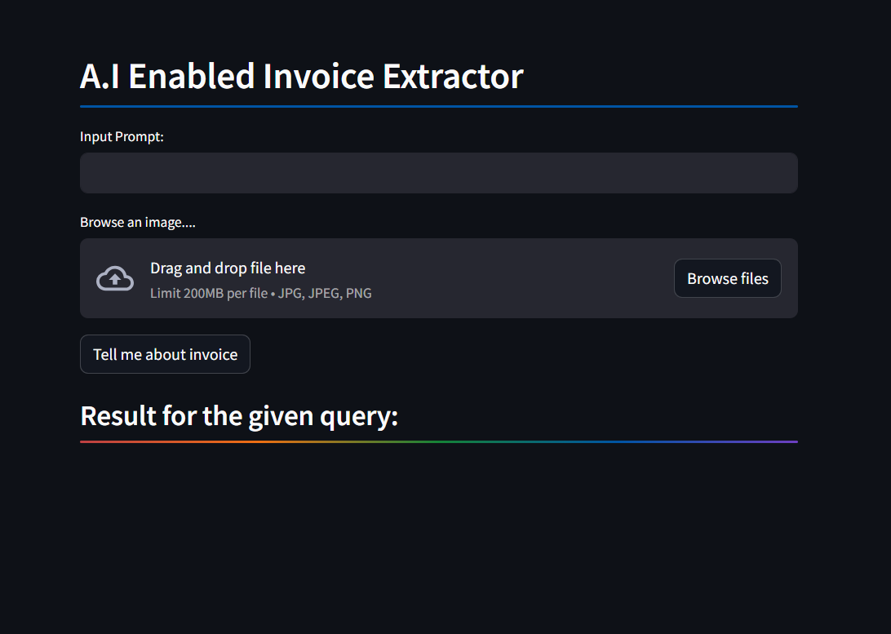

# Invoice Extractor using Google Gemini Pro

This is a Streamlit web application that utilizes the Google Gemini Pro Vision model to extract information from invoice images.

## Introduction

This application allows users to upload an image of an invoice and ask questions related to it. The Google Gemini Pro Vision model is then used to analyze the image and provide responses to the queries.

## Installation

To run this application locally, follow these steps:

1. Clone the repository:

```bash
git clone https://github.com/Abdulkadarkapasi/A.I-Enabled-Invoice-Extractor.git
cd your_repository
```

2. Install the required dependencies:

```bash
pip install -r requirements.txt
```

3. Set up your Google API key by creating a .env file in the project directory and adding your API key. This key is required for accessing the Google Gemini Pro Vision API:

```bash
GOOGLE_API_KEY =  "your_api_key_here"
```

4. Run the Streamlit app:

```bash
streamlit run streamlit_app.py
```

## __Usage__
Once the application is running, follow these steps to extract information from an invoice:

1. Input your query in the provided text input box.
2. Upload an image of the invoice by clicking on the "Browse" button.
3. Click on the "Tell me about invoice" button to get the response.

## __Example__



### Contributing

Contributions are welcome! If you find any bugs or have suggestions for improvements, feel free to open an issue or submit a pull request.